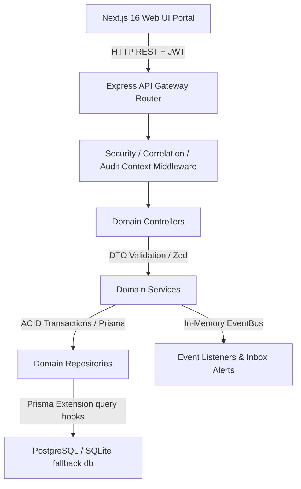
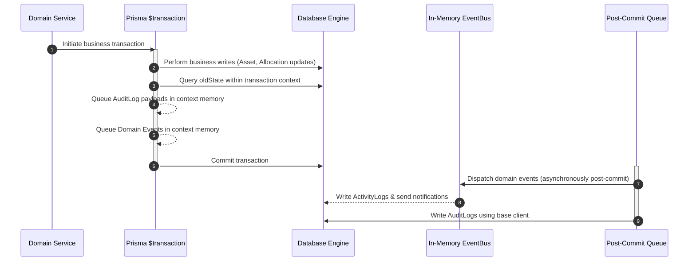

# System Architecture & ER Layout — AssetFlow ERP

This document maps the architectural patterns, workspace layering, event distributions, and entity relationships of **AssetFlow ERP v1.0.0**.

---

## 1. Modular Monolith Architecture

AssetFlow follows a modular monolith design utilizing npm/yarn workspaces to isolate domain scopes.

### Layered Monolith Architecture
- **Presentation Layer**: Custom React 19 pages communicating via Next.js 16 client hooks, managed by Zustand stores.
- **Validation Layer**: Zod schemas validating incoming request bodies.
- **Business Logic Layer**: Domain Services implementing state machines (maintenance state-machine, overlap bookings).
- **Data Access Layer**: Repositories encapsulating Prisma Client transactions.

---

## 2. Event-Driven Subscriptions

An internal publish-subscribe Event Bus synchronizes activities across secondary boundaries:

| Publisher Event | Subscriber Handler | Action Result |
| :--- | :--- | :--- |
| `AssetAllocated` | Notification Service | Dispatches inbox alert and mock email notification |
| `AssetReturned` | Maintenance Service | Triggers pending ticket if return condition matches `DAMAGED` |
| `AuditCompleted` | Asset Service | Flags checklist discrepancies to `LOST` status in registry |

---

## 3. Database Entity Relationship (ER) Model

The schema mapped in `prisma/schema.prisma` establishes relationships between core assets, assignments, and logging records.

### Principal Database Models

- **`User` / `Employee`**: Belongs to a `Department` and links to `UserRole` memberships.
- **`Department`**: Contains organizational locations and references audit cycles.
- **`AssetCategory`**: Defines categorization metadata and default maintenance intervals.
- **`Asset`**: Tracks sequences tags, acquisition details, location states, and is associated with `Allocation` assignments.
- **`Allocation`**: Tracks the assignee, dates, expected returns, and notes.
- **`ResourceBooking`**: Schedules reservations on shared items, validating time ranges.
- **`MaintenanceRequest`**: Manages repairs states, assigned technicians, and resolution costs.
- **`Audit` & `AuditItem`**: Tracks compliance audits, verifications check sheets, and discrepancies logs.
- **`AuditLog`**: Centralized, immutable writes logger.

---

## 4. Transaction Boundaries & Post-Commit Architecture

To ensure high performance and prevent database deadlocks (particularly on single-writer engines like SQLite), AssetFlow strictly separates business transactions from asynchronous side effects:

### Key Architectural Guidelines
1. **Interactive Transaction Scope**:
   - Only critical database modifications (like updating asset status and creating/closing allocation assignments) execute inside the interactive Prisma transaction (`tx`).
   - Transaction execution duration is minimized to sub-100ms.
2. **Context-Aware Reads**:
   - To retrieve the previous database state (`oldState`) for audit logging without deadlocking concurrent writers, query extensions check for an active transaction context.
   - If in a transaction, the `findUnique` query executes on the same transaction client (`tx`) rather than the base client.
3. **Post-Commit Event & Log Dispatching**:
   - Domain events (e.g., `TransferApproved`) and `AuditLog` writes are queued in an asynchronous context queue.
   - Upon a successful commit, the overridden `$transaction` method uses `setImmediate` to flush the events and write the audit records, ensuring no logging or notifications ever block active database locks.
