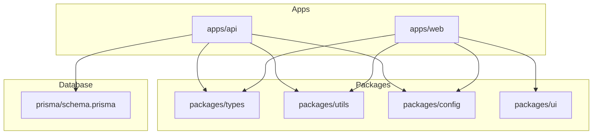

# Prisma & Docker Build Architecture — Developer Manual

This document details the configuration and architectural rules for compiling, typing, and containerizing Prisma Client inside the AssetFlow ERP monorepo.

---

## 1. Workspace Dependency Graph

AssetFlow ERP is built as an npm workspace monorepo:



*Note: `apps/api` depends directly on local compiled workspaces (`@assetflow/types`, `@assetflow/utils`, etc.) and the root Prisma Client types.*

---

## 2. The Prisma Generation & Docker Build Lifecycle

### Why Docker Previously Generated an Incomplete Client
In containerized environments, dependencies are usually installed inside a cached layer to optimize speeds:
1. Previously, the `prisma/` folder was not copied into the build container prior to executing `npm install`.
2. When `@prisma/client` is installed via `npm install`, its postinstall hook attempts to run `prisma generate` to compile schemas. Since `schema.prisma` was missing from the container, it defaulted to generating an empty, default client skeleton.
3. This empty skeleton had no models or enums, resulting in compilation failures inside repositories where `tx` was inferred as `never`.

### Correct Build Order inside Docker
To ensure the container builds are stable:
1. **Copy general monorepo configurations** (`package.json`, `tsconfig.json`).
2. **Copy packages & database schemas** (`packages/`, `prisma/`) so types exist during dependency bootstrap.
3. **Run `npm install`** to fetch standard package modules.
4. **Run `npx prisma generate`** explicitly inside the container to build the complete, custom client.
5. **Compile local package dependencies** (`@assetflow/types`, `@assetflow/utils`, `@assetflow/config`).
6. **Compile the API gateway bundle** (`npm run build --workspace=apps/api`).

---

## 3. Transaction & Extensions Architecture

### Prisma Extensions (`db.ts`)
Prisma 5+ extensions wrap the client instance at runtime to intercept queries.
To preserve the exact inferred types of the extended client, the extended client is exported directly from `db.ts` without any type casts:

```typescript
const extendedPrisma = basePrisma.$extends({ ... });
export const prisma = extendedPrisma;
```

### Type-Safe Transaction Callback Typing
The callback parameter `tx` passed into `prisma.$transaction(async (tx) => { ... })` has the type of the extended client with connection methods omitted.
To avoid type errors and parameter mismatches without resorting to `any` or `unknown`, we declare:

```typescript
export type TransactionClient = Omit<
  typeof extendedPrisma,
  "$transaction" | "$extends" | "$disconnect" | "$connect" | "$on"
>;
```

Apply this type signature strictly in repository callbacks:
```typescript
import { TransactionClient } from "../../../config/db";

async create(data: Input, tx: TransactionClient) {
  return tx.user.create({ data });
}
```

---

## 4. Common Failure Modes & Troubleshooting

### Error: `Property 'xyz' does not exist on type 'never'`
- **Cause**: The compiler cannot find the generated Prisma client types, falling back to a `never` fallback.
- **Solution**: Execute `npx prisma generate` in your terminal to regenerate types locally.

### Error: `Type 'Omit<...>' is missing properties from type 'TransactionClient'`
- **Cause**: A repository method receives a custom transaction client type that doesn't match the list of omitted connection properties.
- **Solution**: Ensure your custom `TransactionClient` definition in `db.ts` matches:
  `Omit<typeof extendedPrisma, "$transaction" | "$extends" | "$disconnect" | "$connect" | "$on">`.
