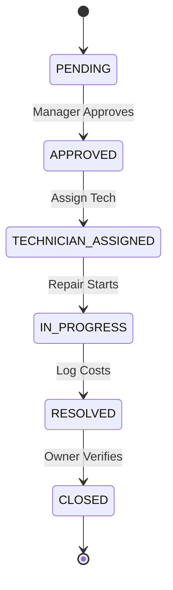

# Workflow Documentation — AssetFlow ERP v1.0.0

This guide documents lifecycle transitions and approval states.

---

## 1. Repairs Maintenance State-Machine (`AF-MAINT`)
Tickets proceed through strict operational transitions:

*Closing the ticket restores the asset registry status to `AVAILABLE`.*

---

## 2. Ownership Transfer Approvals (`AF-TRANS`)
Handovers closing current allocation and mapping assignees:
1. Manager submits transfer request.
2. Target employee accepts transfer or Admin approves.
3. System terminates old active allocation, updates department location, and initializes new allocation.

---

## 3. Compliance Audit Checklist Cycles (`AF-AUDIT`)
Department audits checking current inventory:
1. Auditor initializes audit cycle for department.
2. Checklist items populate automatically from active asset records.
3. Checklist items are checked off as `VERIFIED`, `DAMAGED`, or `MISSING`.
4. Closing the audit locks checklist verifications. Assets marked as `MISSING` automatically transition to `LOST`.
